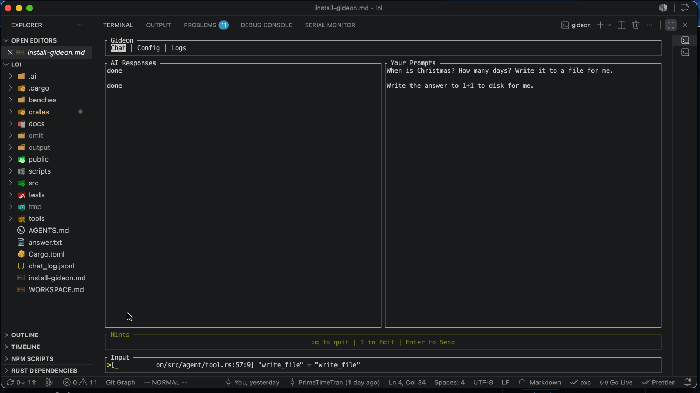

# Gideon

`curl -fsSL https://kb-blog-primetimetran.vercel.app/static/gideon/install.sh | sh`

## Free & Open Source
- Use whichever frontier model you want.

# Done

- FREE AI models
- MCP
- CLI Tool
- Accepts prompts
- Chat history
- Logs
- Uses tools
- Cmd Prefix

# TODO

- Doc version, changelog, readme, demo
- Doc ctrl prefix
- Add copy response by number
- Add up/down arrows for history
- Create multi platform builds
- Publish download url/script
- Add hints,
  - Most useful,
  - tab specific
- Add context,
  - Which files are in memory
  - Which files are in memory
- Add CLI Commands
  - Help
  - Version
  - Config
    - Write path
  - Settings
  - Settings
